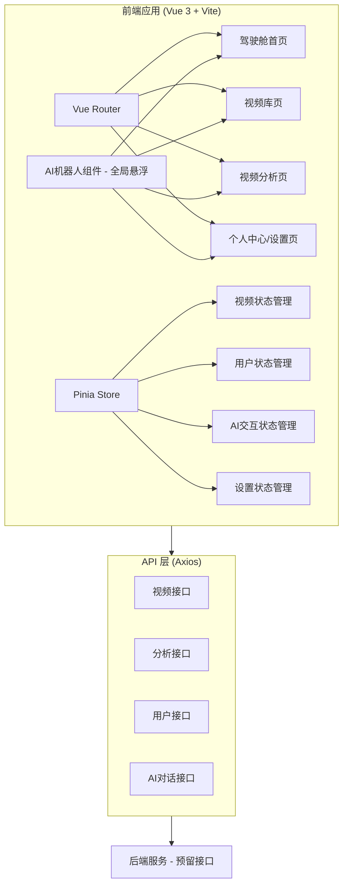
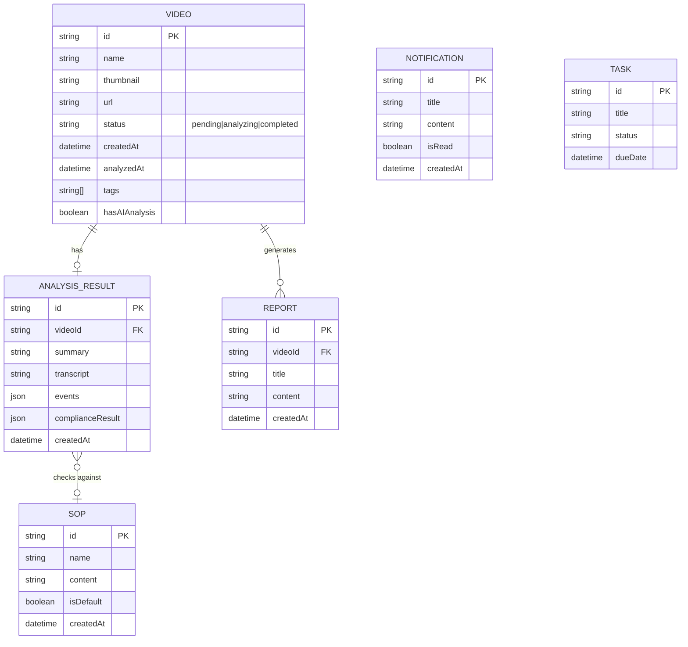

# 视频分析AI应用 - 项目设计文档

## 1. 系统架构



## 2. 页面结构 ER 图



## 3. 页面路由清单

| 路由路径 | 页面名称 | 描述 |
|---------|---------|------|
| `/` | 驾驶舱首页 | 数据仪表盘 + AI交互中心 |
| `/videos` | 视频库页 | 视频列表/网格 + 搜索筛选 |
| `/analysis/:id` | 视频分析页 | 视频播放 + AI分析 + 报告 |
| `/settings` | 个人中心/设置页 | 个人信息 + 系统配置 |

## 4. UI/UX 设计规范

### 色彩体系
- 主色调: `#0A1628` (深空蓝 - 驾驶舱背景)
- 强调色: `#00D4FF` (科技蓝 - 高亮/按钮)
- 辅助色: `#7B61FF` (紫色 - AI相关元素)
- 成功色: `#00E676`
- 警告色: `#FFD740`
- 错误色: `#FF5252`
- 文字主色: `#E0E6ED`
- 文字次色: `#8892A4`
- 卡片背景: `rgba(16, 32, 56, 0.85)`
- 边框色: `rgba(0, 212, 255, 0.15)`

### 字体规范
- 主字体: `'Inter', 'PingFang SC', sans-serif`
- 数据字体: `'Orbitron', monospace` (仪表盘数字)
- 标题: 20px / 16px / 14px
- 正文: 14px
- 辅助: 12px

### 间距系统
- 基础单位: 8px
- 组件间距: 16px / 24px
- 区域间距: 32px
- 页面边距: 24px

### 圆角规范
- 卡片: 12px
- 按钮: 8px
- 输入框: 8px
- 标签: 4px

### 动效规范
- 过渡时长: 0.3s
- 缓动函数: cubic-bezier(0.4, 0, 0.2, 1)
- 悬浮效果: translateY(-2px) + box-shadow增强

## 5. 组件设计说明

### AI机器人组件 (AIBot.vue)

全局悬浮的 AI 交互入口，提供：

| 功能 | 说明 |
|------|------|
| 悬浮显示 | 固定在页面右下角，可拖拽移动 |
| 气泡菜单 | 点击展开导航选项和对话入口 |
| 对话面板 | 支持文字输入和语音识别 |
| 语音导航 | 解析语音指令执行页面跳转 |

### 视频播放器组件 (VideoPlayer.vue)

模拟视频播放器，支持：
- 播放/暂停控制
- 进度条拖拽
- 倍速选择 (0.5x - 2x)
- 时间显示

### 事件时间轴组件 (VideoTimeline.vue)

可视化展示视频关键事件：
- 时间轴刻度显示
- 事件节点标记（不同类型不同颜色）
- 点击节点跳转到对应时间点

### 报告导出组件 (ReportExporter.vue)

分析报告生成与导出：
- 报告预览
- 多格式导出 (PDF/HTML/DOCX)
- 内容定制选项

## 6. 语音指令系统

### 支持的指令

| 指令类别 | 示例 | 功能 |
|----------|------|------|
| 导航指令 | "打开视频库"、"回首页" | 页面跳转 |
| 功能指令 | "生成报告"、"上传视频"、"生成SOP" | 触发功能 |
| 控制指令 | "播放"、"暂停"、"快进"、"后退"、"跳转到1分30秒" | 视频控制 |
| 帮助指令 | "帮助"、"你能做什么" | 显示帮助 |

### 视频播放器语音控制

在视频分析页面，支持以下语音指令控制视频播放：

| 指令 | 功能 |
|------|------|
| "播放" / "开始" | 开始播放视频 |
| "暂停" / "停止" | 暂停视频播放 |
| "快进" / "前进" | 快进 10 秒 |
| "后退" / "倒退" | 后退 10 秒 |
| "跳转到 X 分 Y 秒" | 跳转到指定时间点 |
| "定位到 X 秒" | 跳转到指定秒数 |

### 指令匹配机制

1. 精确匹配：输入完全等于预设同义词
2. 包含匹配：输入包含预设同义词
3. 模糊匹配：基于编辑距离的相似度匹配

### 冲突处理

- 同类指令短时间内切换需二次确认
- 低置信度匹配需用户确认
- 超时自动取消待确认指令

## 7. SOP AI 生成功能

### 功能说明

系统支持根据视频分析结果自动生成标准操作规程 (SOP)：

1. 在视频分析页面点击"生成SOP"按钮
2. 或在 AI 对话中说"生成SOP"
3. 系统根据合规检测结果和视频摘要自动生成 SOP

### 生成内容

自动生成的 SOP 包含：

- 生成时间和视频信息
- 视频摘要
- 合规要求（已符合的项目）
- 需改进项（未通过的检测项）
- 针对性改进建议
- 标准操作流程

### API 接口

```
POST /ai/sop/generate/:videoId
```

详见 [API 参考文档](./api_reference.md)

## 8. 状态管理设计

### Store 职责划分

| Store | 职责 |
|-------|------|
| VideoStore | 视频列表、筛选、当前视频 |
| AIStore | AI 对话消息、处理状态、位置 |
| SettingsStore | 用户设置、主题、SOP、知识库 |
| DashboardStore | 仪表盘数据、任务、通知 |

### 数据流

```
用户操作 → Action → Mutation → State → 视图更新
                ↓
            API 调用 (可选)
```

## 9. 错误处理策略

详见 [错误处理文档](./error_handling.md)

## 10. 性能优化措施

详见 [性能优化文档](./performance.md)

## 11. API 集成说明

### Mock 数据模式

当前版本为纯前端演示应用，所有 API 默认返回模拟数据。这是为了让用户无需后端服务即可体验完整功能。

### 切换到真实 API

1. 设置环境变量：
```bash
VITE_USE_MOCK=false
VITE_API_BASE_URL=https://your-api-server.com/api
```

2. 确保后端服务实现了所有接口（详见 [API 参考文档](./api_reference.md)）

### API 调用特性

- **自动 Mock 回退**：`VITE_USE_MOCK=true` 时自动返回模拟数据
- **错误回退**：真实 API 调用失败时可选择回退到 Mock 数据
- **自动重试**：网络错误或 5xx 错误时自动重试（最多3次）
- **空数据处理**：自动处理空响应，返回默认值

详见 [API 参考文档](./api_reference.md)
